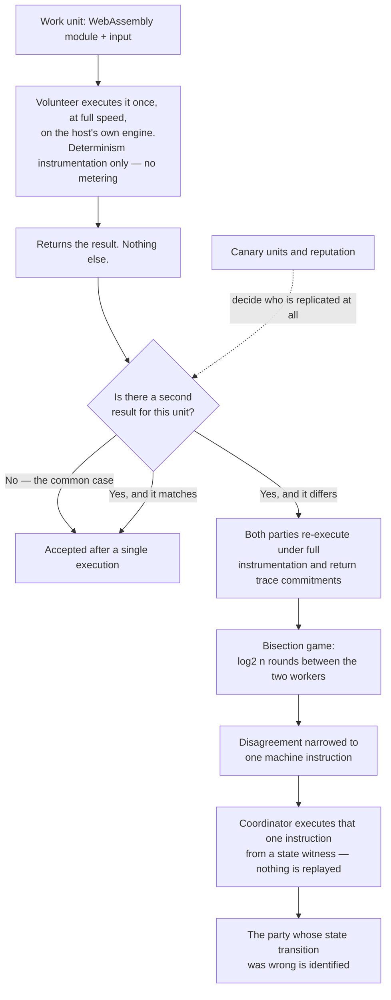
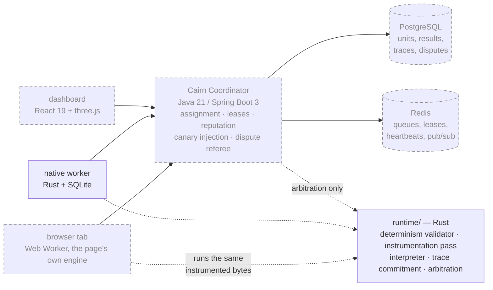

# Cairn — Architecture

> A cairn is a pile of stones. Each traveller passing a hard route adds one. No single
> stone is a landmark; the pile is. That is the shape of volunteer computing.

This document explains **what Cairn is**, **the one hard problem it exists to solve**, and
**how the pieces fit**. It is the entry point for anyone — human or agent — picking this
project up cold.

---

## 1. The problem

There are billions of idle CPUs in the world. Volunteer computing has harvested them
before, and it produced real science: Folding@home briefly exceeded the combined power of
the world's top supercomputers during the 2020 pandemic, and its output appears in
peer-reviewed literature.

But the platforms that made that possible (BOINC, 2002) carry two structural costs that
have never been fixed:

**Cost 1 — the participation barrier.** You must download and install a native client.
That single step eliminates the overwhelming majority of potential contributors.

**Cost 2 — the verification tax.** Volunteer machines are *untrusted*. They may return
fabricated results to farm credit, or corrupted results because the RAM is bad or the CPU
is overclocked — historically the more common failure. BOINC's answer is **redundant
execution**: send every work unit to N machines and require a quorum. That works, and it
means **a third to a half of the entire network's power is spent re-doing arithmetic
someone already did correctly.**

Cairn attacks both. Cost 1 is an engineering problem (compile the worker to WebAssembly,
run it in a browser tab, no install). Cost 2 is the interesting one, and it is the reason
this project is worth building.

---

## 2. The core idea: optimistic execution with dispute-time arbitration

The insight is that **verification and re-execution are not the same thing.** BOINC pays
full re-execution cost on every unit in order to catch the rare liar. Cairn pays almost
nothing on the honest path and makes the liar pay on the rare dishonest one.



### 2.1 The fast path

A work unit is a deterministic WebAssembly program plus its input. A volunteer executes it
**once**, at full speed, on the browser's own native WASM engine, and returns the **result**.
That is all. No trace, no commitment, no snapshots.

That is a deliberate reversal of the original design, which had the worker return a Merkle
root over periodic state snapshots alongside the result. It cannot: a stock WebAssembly engine
does not let its embedder see the operand stack, a live frame's locals, the frame chain, or
the program counter — four of the seven fields a Cairn state commitment covers. The full
argument, and what the reversal costs and buys, is
[ADR-0005](docs/adr/0005-the-fast-path-cannot-snapshot.md).

The fast path still runs an *instrumented* module, just not a metered one: NaN canonicalization
and the validated feature set are what make two honest workers agree at all, and they cannot be
deferred. But they turned out to be nearly free, once it was clear *where* they are actually
needed — an engine-chosen NaN can only change an answer at four operations, so those are the
only places the honest path canonicalizes
([ADR-0006](docs/adr/0006-canonicalize-nans-at-escapes-on-the-honest-path.md)).

Measured: honest-path overhead is inside the benchmark's ±2% noise floor on **all four**
workload shapes, floating point included.

```
volunteer returns:   result = f(input)
on dispute only:     commit = merkle_root([ state@0, state@2^k, ... , state@end ])
```

### 2.2 Deciding what to trust

Most units are accepted on one execution. Confidence comes from three cheap sources
instead of from redundancy:

1. **Canary units.** Units whose correct answer the coordinator already knows, injected
   into the stream indistinguishably from real work. They continuously measure each
   worker's honesty *and* their hardware's integrity, at a tunable sampling rate.
2. **Reputation.** A per-worker posterior on "returns correct results", updated by canary
   outcomes and dispute outcomes. High-reputation workers earn lower replication.
3. **Selective replication.** Units that are high-value, or assigned to low-reputation
   workers, get a second independent execution.

### 2.3 The dispute game

When two workers return different **results** for the same unit, each is asked to produce a
trace: they re-execute the unit under the fully instrumented module and return a Merkle root
over its snapshots. Because execution is deterministic, that re-execution *is* the original
one. From there the two workers play an interactive bisection game, refereed by the
coordinator, and the coordinator still never re-runs the job itself:

```
Round 1:  disagree over instructions [0, N)          → both reveal state@N/2
Round 2:  disagree over [0, N/2) or [N/2, N)         → both reveal midpoint of that half
...
Round log₂(N): disagree over a single instruction i
Final:    coordinator executes instruction i alone, on the instrumented interpreter,
          and learns which worker lied.
```

```mermaid
sequenceDiagram
    autonumber
    participant A as Worker A
    participant C as Coordinator
    participant B as Worker B
    Note over A,B: Results differ. Both re-execute under full<br/>instrumentation; their trace commitments differ in steps 0..N
    loop log2 N rounds
        C->>A: reveal your state at the midpoint of the disputed range
        C->>B: reveal your state at the midpoint of the disputed range
        A-->>C: hash
        B-->>C: hash
        Note over C: hashes equal → they diverged later, keep the upper half<br/>hashes differ → they diverged earlier, keep the lower half
    end
    Note over A,B: Disputed range is now a single instruction i
    A-->>C: state witness for step i + Merkle proofs
    B-->>C: state witness for step i + Merkle proofs
    Note over C: rebuild the commitment from the witness and check it<br/>equals the root bisection already established
    C->>C: execute instruction i — once
    Note over C: whoever's claimed post-state does not match, loses
```

The coordinator's work is **one instruction**, not N: `O(log N)` messages, and compute that
does not grow with the length of the disputed execution.

It can execute that instruction without replaying anything because the parties supply a **state
witness** — the small parts of the machine whole, and memory as only the pages that instruction
touches, each with a Merkle proof binding it to the state root bisection established. This is
the same skeleton as an optimistic rollup's fraud proof, applied to scientific computation
instead of financial state.

**All of that is the coordinator's cost. The two parties pay something quite different**, and it
is worth being exact about who bears what. A trace commitment covers machine state no host
engine exposes, so a challenged party cannot produce one on the engine they did the work with —
they re-execute under Cairn's interpreter, which measures **37×–142×** slower. Including the
bisection answers that is roughly **200× a normal execution, per party, per dispute**. It is
bounded, it is rare, it never touches the coordinator's scaling — and it puts a real budget on
the dispute rate, below about 1 in 4,000 units.
[ADR-0008](docs/adr/0008-a-dispute-costs-an-interpreted-re-execution.md) does that arithmetic.

### 2.4 Why this is the whole project

Everything else here is competent but ordinary engineering. **This is the part that is
genuinely hard and genuinely new for this domain.**

What measured exactly as designed is the arbitration itself: dispute cost does not grow with
execution length (a hundredfold longer execution costs six more rounds), and a witness is one
64 KiB page in the worst case observed.

The cost story has been rewritten three times by evidence, and every rewrite is in the ADRs
rather than smoothed away. The original claim — beat replication because instrumentation costs
≈5% — was **refuted** by measurement
([ADR-0004](docs/adr/0004-measured-cost-supersedes-the-efficiency-claim.md)). Then the
execution model it assumed turned out to be **unbuildable**, and replacing it moved metering
and snapshots off the honest path entirely
([ADR-0005](docs/adr/0005-the-fast-path-cannot-snapshot.md)). That left the cost of bit-exact
floating point, which turned out to be avoidable once it was clear how few operations can turn
a NaN's engine-chosen bits into a different answer
([ADR-0006](docs/adr/0006-canonicalize-nans-at-escapes-on-the-honest-path.md)).

Where it lands: honest-path overhead inside the measurement noise on all four benchmark
shapes, and **1.12×–1.15× against replication's 2.00×**. ADR-0001's conclusion holds — by a
route it did not describe, on a path it did not propose, for reasons it did not give.

---

## 3. The determinism requirement

The dispute game is meaningless unless **two honest workers running the same unit produce
byte-identical traces.** Non-determinism does not merely degrade Cairn; it turns honest
workers into apparent liars. This constraint drives most of the runtime design.

WebAssembly is deterministic by construction with a small set of known escapes. Cairn
closes each one:

| Escape | Resolution |
|---|---|
| NaN payload bits are implementation-defined | Canonicalize NaNs after every float op |
| SIMD ops with under-specified corner cases | Feature disabled in the validator |
| Threads / shared memory / atomics | Feature disabled; a unit is single-threaded by definition |
| Host clock, entropy, filesystem, network | Not reachable — the host interface exposes none of them |
| Memory-growth failure depends on host RAM | Fixed memory ceiling per unit, declared in the manifest; OOM is deterministic |
| Divergent instruction counting | Explicit fuel metering, baked into the module rather than counted by the engine. Only the dispute path runs it, since only that path commits to a trace (ADR-0005) |

**The top technical risk in this project** is that the fast path (the browser's native WASM
engine) and the slow path (our instrumented interpreter) disagree on some edge case. If
they do, arbitration convicts honest workers. This is addressed by differential fuzzing of
the two engines against each other as a first-class, always-on part of CI — not as an
afterthought.

---

## 4. Components



**Solid box = exists. Dashed = designed, not built.** Today that is two of seven: `runtime/`
and the native worker. See [docs/MAINTAINER.md](docs/MAINTAINER.md) for what that means in
practice before you plan work against this diagram.

### `runtime/` — Rust
The deterministic execution kernel. Two engines behind one interface:
- **fast**: hand off to the host WASM engine, take periodic state snapshots
- **slow**: a fully instrumented interpreter capable of executing one instruction in
  isolation from a committed state, used only by the coordinator during arbitration

Also owns the Merkle trace commitment, the fuel meter, and the determinism validator that
rejects a workload binary using a forbidden feature.

### `coordinator/` — Rust · **built**
Dispatches units, collects results, and settles the disagreements. `cargo run -p
cairn-coordinator -- <workload> <inputs…>` and a volunteer can start contributing from a
browser tab.

**It is Rust rather than the Java below, because the referee executes.** Bisection is a pure
state machine any language can drive, but adjudication rebuilds a machine from a state witness
and steps it once — that is the execution kernel, called from the coordinator. A Java
coordinator would need JNI, a subprocess, or a second implementation of consensus-critical
code; the third is unthinkable and the other two buy nothing until there is a database to be
transactional about. See [ADR-0010](docs/adr/0010-the-referee-executes-so-the-coordinator-is-rust.md).

What it has: registration through the admission gate, a work queue, leases that expire,
one-volunteer-one-vote, a replication rate, and a referee. What it does not have: **a database,
reputation, canaries, and the interactive dispute protocol.** A disagreement is settled by the
referee executing the unit once itself — correct, but ordinary replication rather than
bisection, and `grid.rs` says so at length where it happens.

### `server/` — Java 21 / Spring Boot 3 · **superseded for now**
The coordinator this describes is what Cairn wants when it has a database, transactions and
reputation bookkeeping. [ADR-0010](docs/adr/0010-the-referee-executes-so-the-coordinator-is-rust.md)
suspends rather than overturns it, and records what moving back would cost.
The coordinator. Work-unit lifecycle, lease management, result intake, canary injection,
reputation, and the dispute referee. Virtual threads carry the WebSocket fan-in; there is
no separate gateway service and no second backend language, because Java 21 does not need
one.

### `browser/` — JavaScript · **built**
The zero-install volunteer. Runs inside a Web Worker so the page stays responsive, honours a
CPU budget, and backs off on battery power and metered connections. Opening a web page is the
entire onboarding flow.

**It contains no WebAssembly engine, and that is the design.** This was going to be Rust
compiled to WASM until [ADR-0005](docs/adr/0005-the-fast-path-cannot-snapshot.md) established
that a volunteer cannot produce a trace on *any* engine — so the honest path has nothing left
to do but run the module the browser can already run. What remains is three imported functions
and a counter to read afterwards: no dependencies, no build step, and no toolchain between a
person and contributing. Trace production is a separate, dispute-time path in `runtime/`.

### `worker-native/` — Rust · **built**
`cairn-worker`: `run` a unit on wasmtime under honest-path instrumentation, `trace` one on the
interpreter to produce a commitment, `dispute` two claimed executions end to end. Running the
last of those is the shortest description of this project that exists.

Still to come for a machine actually donating time: SQLite for the local unit cache, resumable
state, and schedule/core limits ("only overnight, only 6 cores").

### `web/` — React 19 + TypeScript + Tailwind + three.js + GSAP
The contributor-facing surface. The globe renders **live node topology and real throughput
off the WebSocket** — it is instrumentation, not decoration. A contributor should be able
to see what they are computing and why it matters.

### `workloads/`
Real science, compiled to WASM. The first target is molecular docking for virtual drug
screening: one compound per work unit, embarrassingly parallel, deterministic, and
genuinely useful.

---

## 5. Data stores

- **PostgreSQL** — the system of record: projects, workloads, work units, assignments,
  results, trace commitments, disputes, reputation history.
- **Redis** — the hot coordination path: assignment queues, unit leases with TTL,
  heartbeats, and pub/sub for dashboard fan-out. Nothing here is authoritative; a total
  Redis loss costs in-flight assignments, not data.
- **SQLite** — embedded in the native worker for local cache and resumable state. Also
  backs a single-binary local mode so a contributor can run the full loop with no
  infrastructure at all.

---

## 6. What is deliberately not here

- **No blockchain, no token.** The dispute protocol borrows a mechanism from optimistic
  rollups; it does not need a chain, and a token would replace scientific motivation with
  speculative motivation.
- **No GPU workloads in v1.** WebGPU compute is not deterministic enough across vendors for
  the arbitration scheme to hold. CPU first, honestly.
- **No second backend language.** See §4.
- **No trust in the coordinator being unnecessary.** Cairn reduces trust in *workers*. The
  coordinator is still trusted. Removing that is future work, not a v1 claim.

---

## 7. Status

Under active construction, and **most of this document describes intent rather than code.**
The Rust runtime exists and is finished end to end; nothing else in §4 has been written.

- **[docs/MAINTAINER.md](docs/MAINTAINER.md)** — what works, what does not, the invariants
  that must not be broken, and where to start. Read this before planning any work.
- **[docs/GOOD_FIRST_ISSUES.md](docs/GOOD_FIRST_ISSUES.md)** — nine specified pieces of work,
  sized.
- **[docs/adr/](docs/adr/)** — the decisions behind the above, including
  [ADR-0004](docs/adr/0004-measured-cost-supersedes-the-efficiency-claim.md), which refutes
  part of ADR-0001.
