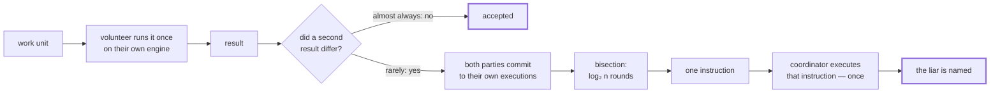

<div align="center">

# Cairn

**English** · [简体中文](README.zh-CN.md)

**A supercomputer made of spare moments.**

Open a browser tab, donate the CPU you were not using, and help compute something that
matters. No install, no account, no token.

[](LICENSE)
[](#roadmap)

</div>

---

> A cairn is a pile of stones. Each traveller passing a hard route adds one. No single
> stone is a landmark; the pile is.

---

## What this is

There are billions of idle CPUs in the world. Volunteer computing has harvested them
before, and it produced real science — during the 2020 pandemic, Folding@home briefly
exceeded the combined power of the world's top supercomputers.

But the software that made that possible was designed in 2002, and it carries two costs
that were never fixed:

**You have to install something.** That one step loses almost everyone.

**Half the network re-does work that was already done correctly.** Volunteer machines
cannot be trusted — some lie to farm credit, and many more return corrupted results
because the RAM is failing or the CPU is overclocked. The classic defence is to send every
job to two or three machines and compare. It works, and it throws away a third to a half of
all the power people donated.

Cairn attacks both.

The first is engineering: the worker is a Web Worker around the WebAssembly engine the browser
already has. Opening a page is the entire onboarding flow — no install, no dependencies, and
no build step. [`browser/`](browser) does this today.

The second is the reason this project exists. The verification mechanism works, is cheap to
arbitrate, and — after a design correction described below — costs the honest volunteer
essentially nothing on most workloads. Floating point is the exception, and it is the
project's open problem.

## The idea

**Verification and re-execution are not the same thing.**

A volunteer runs the job once and returns the answer. Nothing else — no proof, no trace.
Most jobs are accepted after that **single** execution. Confidence comes from decoy jobs
whose answers we already know, silently mixed into the stream, plus a reputation score
built from how workers handle them.

When two workers *do* return different answers, nobody re-runs the job to see who was right.
Instead, each is asked to show their working: they re-execute under instrumentation and
return a cryptographic commitment to how their execution went. Then they play a bisection
game — binary-searching those commitments down to **the single machine instruction where
their executions first diverged** — and the coordinator executes that one instruction to
find out who lied.



**Read the diagram by how thick the traffic is, not by how many boxes there are.** Almost every
unit takes the top row and stops. The machinery underneath exists so that the top row can be
one execution instead of two or three — and it runs only when somebody actually disagrees.

Checking one instruction instead of a billion. `O(log n)` messages, and work that does not
grow with how long the disputed job ran — arbitrating a trillion-instruction unit costs what
arbitrating a thousand-instruction one costs.

The mechanism is borrowed from optimistic rollups and pointed at science instead of
finance. The full design, including why bit-exact determinism is a hard requirement and
what it costs, is in **[ARCHITECTURE.md](ARCHITECTURE.md)**.

## What is measured

`cargo bench` regenerates [docs/benchmarks.md](docs/benchmarks.md). The short version:

| Claim | Status |
|---|---|
| Arbitration cost is independent of execution length | **Confirmed.** 21k steps → 15 rounds; 2.1M steps → 21 rounds. Every divergence point of every length up to 512 checked exhaustively, and the documented `⌈log₂ n⌉` turns out to be a **band** — `⌈log₂ n⌉ - 1` to `⌈log₂ n⌉`, upper end attained |
| A witness is small | **Confirmed, with a caveat now pinned by a test.** One 64 KiB page for ordinary instructions; a `memory.fill` reaches as far as its length says, and 100,000 bytes touches two. The workload's answer is carried as a 32-byte digest, so a witness does not grow with it |
| Agreeing traces prove agreeing answers | **Was false, now true.** The commitment covered how the machine ran and not what it said, so two parties could agree on a million roots and prove nothing about the result — see ADR-0012 |
| Metering does not change what a program computes | **Confirmed.** Every differential case, both engines, identical output and trapping |
| Instrumentation overhead is ≈5% | **Refuted.** Nothing like it — see ADR-0004 |
| A volunteer can commit to their own execution | **Refuted.** A stock WASM engine hides four of the seven fields a commitment needs — see ADR-0005 |
| A NaN payload cannot change an answer | **Confirmed** across four engines, including a JIT and the browser's own, on 300 randomly generated float expressions. Checked for teeth against the engine it is about: delete the `copysign` escape site and **V8 answers `-1.5` where Cairn answers `+1.5`** |
| A workload can get `exp` and `sin` from the host | **Refuted, and then refuted again for a second reason.** V8 and the platform libm return different bits on **every one** of twelve functions — 29.8% of `cbrt` calls, 17.8% of `sinh`. That alone would put two honest volunteers on opposite sides of a dispute. Worse: for the worst-case argument in the format, the platform's own `sin` returns **`-0.2227` where the answer is `1.0`** — confirmed by exact integer arithmetic over a 3000-bit `π`, by V8, and by this project's library, all three agreeing against it. Host math is not merely inconsistent between hosts; it is not dependably correct on any of them. See [ADR-0016](docs/adr/0016-math-belongs-in-the-module-not-the-host.md) |
| Engines agreeing is evidence the answer is right | **No — and almost every test here only checks agreement.** Three engines computing the same wrong number agree perfectly. Cairn's guarantee is that two volunteers computed *the same thing*; whether that thing is the right science is the workload author's problem and always was. The periodogram is the first workload whose test asserts both: three engines identical bit for bit, **and** a signal synthesised at a known frequency coming back at that frequency. See [ADR-0020](docs/adr/0020-the-first-real-workload-is-a-periodogram-not-docking.md) |
| A workload should be `no_std`, so it cannot reach a clock or an allocator | **Refuted as a guarantee — it is a proxy, and the real property is checkable.** `no_std` does not compose with this project's own math library: `f64::sqrt`, `floor`, `ceil`, `trunc` and `round_ties_even` are single WebAssembly instructions that Rust puts in `std` rather than `core`, so a `no_std` workload using it fails with `found duplicate lang item panic_impl`. Chasing `no_std` would mean replacing a specified, correctly-rounded instruction with a hand-written one. What `no_std` was standing in for — **nothing comes from the host** — is read directly off the module's import section, and the template is required to import exactly `cairn.input` and `cairn.output`. See [ADR-0019](docs/adr/0019-no-std-is-a-proxy-and-the-import-list-is-the-property.md) |
| Cairn admits what a stock toolchain emits | **Refuted — it admitted the one shape that had been tried.** `rustc` writes `call_indirect`'s table index as a padded five-byte LEB128 where the specification wants one zero byte, so **every workload containing a trait object or a function pointer was refused**: one table, index zero, no reference near a value, and an interpreter that implemented the instruction fully. The refusal was about the spelling of a zero. It survived because the only compiled workload here was a math library, and statically resolved arithmetic never touches a function table. See [ADR-0018](docs/adr/0018-a-compilers-call-indirect-is-not-the-specifications.md) |
| The engine volunteers actually run agrees with Cairn | **Confirmed, and it was unchecked until now.** 1,046 generated units through the browser worker's own `host.js` on V8 — output, trap behaviour and exact instruction count. Every other engine in the gate is Rust linked into the test binary; none of them is the one this project is for |
| The interpreter agrees with real engines on arbitrary code | **Not yet.** Whole-module generation found a bug on its first run — `br 0` at function scope returns, and Cairn had no function label. Fixed; 146 generated modules now agree, on Cairn, wasmi, wasmtime and V8. Absence of evidence, so far |
| The honest path costs a volunteer nothing | **Confirmed on a compiler** — 0% under wasmtime on all four shapes, floating point included |
| Cairn beats replication on cost | **Yes, currently.** ≈1.09×–1.18× against replication's ≈2.0×, on all four workload shapes |
| Arbitrating a dispute is cheap **for the coordinator** | **Confirmed.** `O(log n)` messages and one instruction, whatever the execution length |
| Arbitrating a dispute is cheap **for the two parties** | **No.** They must re-execute under Cairn's interpreter to produce a trace at all, and it is 37×–142× slower than the engine they did the work on |
| A party's dispute cost is set by execution length | **Refuted.** It is set by *where the two diverged*. Checkpointed replay makes a late-diverging 1.9M-step dispute **14.4× cheaper** and an early-diverging one no cheaper at all |

That last row took three reversals to get to, and none of them are hidden:

1. Measurement **refuted** the original cost claim — ≈5% assumed, nothing like it in practice
   ([ADR-0004](docs/adr/0004-measured-cost-supersedes-the-efficiency-claim.md)).
2. The execution model underneath it turned out to be **unbuildable** — a stock WASM engine
   will not show you the operand stack — so the trace moved to dispute time
   ([ADR-0005](docs/adr/0005-the-fast-path-cannot-snapshot.md)). That took metering and
   snapshots off the honest path and left only the cost of making floating point bit-exact.
3. That last cost turned out to be avoidable: an engine-chosen NaN only matters where its bits
   can become something other than a NaN, and that is **four operations**
   ([ADR-0006](docs/adr/0006-canonicalize-nans-at-escapes-on-the-honest-path.md)). The float
   kernel's honest-path instruction count went from 2.30× bare to **1.00×**.

**ADR-0001's conclusion is therefore right, and its reasoning is still wrong.** The number came
back because the honest path now does almost nothing, not because the original 5% estimate was
correct. Both facts are in the ADRs.

A fourth reversal followed immediately, and it cuts the other way. Every figure above came from
Cairn's interpreter. Running the same workloads on **wasmtime**, a real optimising compiler,
confirms the honest path is free — and showed fuel metering costing **five to six times** there
against 18%–41% in the interpreter
([ADR-0007](docs/adr/0007-metering-is-a-jit-problem-not-an-interpreter-problem.md)). **The
engine you measure on is part of the measurement.**

Then a fifth, from asking who actually runs that module — and the answer was nobody. A trace
commitment covers the operand stack and every frame's locals, so a challenged party cannot
produce one on their own engine any more than a volunteer could. **They re-execute under
Cairn's interpreter, which is 37×–142× slower than the JIT they did the work on**
([ADR-0008](docs/adr/0008-a-dispute-costs-an-interpreted-re-execution.md)). That is the real
price of a dispute, it falls on the parties rather than the coordinator, and it puts a hard
budget on how often disputes may happen — **below roughly 1 in 4,000 units.**

And a sixth, from finally building the fix the third and fourth had been circling. Metering
through a counter global instead of a host call is **3×–6× faster on a compiler and 9%–26%
slower in the interpreter** — and the interpreter is the only engine that runs a metered module,
so the change makes disputes *dearer*, not cheaper, and the dispute path keeps the host call
([ADR-0009](docs/adr/0009-metering-through-a-global-the-engines-disagree.md)). What it buys is
something nobody asked for and everybody will want: on a compiler, metering falls from **+540%
to +8%**, which means **an engine Cairn does not control can now report how much work it did** —
run the module, read the exported counter. That was unavailable at any price a volunteer would
accept.

**The benchmark measures its own error rather than asserting one**, by timing pairs of
configurations that compile to byte-identical modules. When that error exceeds the effect, the
figure prints as *not resolved* instead of as a result — on one earlier run it reached 148%,
and an earlier version of this benchmark would have reported those numbers as findings.

## Stack

| Layer | Choice | Why |
|---|---|---|
| Coordinator | **Rust**, `tiny_http` | **The referee executes** — adjudication steps a machine rebuilt from a state witness, so a Java coordinator would need JNI, a subprocess, or a second implementation of consensus-critical code. Java 21 + Spring is what it wants once there is a database; [ADR-0010](docs/adr/0010-the-referee-executes-so-the-coordinator-is-rust.md) suspends that rather than overturning it |
| Execution kernel | **Rust** | Deterministic interpretation and instruction-level replay; the JVM cannot do this |
| Browser worker | **JavaScript**, no build step | Zero-install contribution inside a Web Worker, around the engine already in the page. Rust→WASM was the plan until ADR-0005 made it unnecessary |
| Native worker | **Rust** | Single binary, multi-core, for donated machines |
| System of record | **an append-only log** | Units, results, disputes. PostgreSQL is deferred, not planned: the coordinator has no queries to serve, and every read is a scan of a `Vec` — [ADR-0014](docs/adr/0014-the-coordinator-keeps-a-log-not-a-database.md) |
| Hot path | **Redis** | Queues, leases, heartbeats, dashboard fan-out |
| Frontend | **React 19** + TS + Tailwind + three.js | The globe shows live node topology, not an animation |

There is no Go service, and that is deliberate — Java 21's virtual threads already cover
the high-concurrency case, and a language earns its place here by doing something the
others cannot. See [ADR-0002](docs/adr/0002-language-boundaries.md).

## Quick start

**In a hurry, or want the guided version?** [docs/WALKTHROUGH.md](docs/WALKTHROUGH.md) is six
commands in twenty minutes, each one answering a question, ending with a million-instruction
disagreement settled by executing a single instruction.

Otherwise: Rust, and nothing else installed. Do a work unit:

```bash
cargo run -p cairn-worker -- run workloads/examples/sum-of-squares.wat workloads/examples/input-a.bin
```

Now have two volunteers disagree about that same unit, and find out which one is lying:

```bash
cargo run -p cairn-worker -- dispute workloads/examples/sum-of-squares.wat workloads/examples/input-a.bin workloads/examples/input-b.bin
```

```
disputed length   1050030 instructions
bisection rounds  20
divergence        step 1050016
time to bisect    39.8ms

Adjudicating that one instruction took 52.3µs.
Verdict: the second party was wrong.
```

**That is the entire idea, in one command.** A million-instruction disagreement, settled by
executing *one* instruction — and the referee's 52µs is what does not grow when the execution
does. `cairn-worker trace` shows the other half: the same unit, on the interpreter, producing
the commitment that made the bisection possible.

To watch it happen rather than read about it — every bisection round, the bracket narrowing,
and the one instruction the coordinator finally executes:

```bash
cargo run --example dispute
```

### The whole system, in one command

```bash
cargo run -p cairn-coordinator -- workloads/examples/sum-of-squares.wat \
  workloads/examples/input-a.bin workloads/examples/input-b.bin
```

Open the address it prints and press **Start contributing**. The tab takes a unit, runs it on
the browser's own engine, reports the answer *and how many instructions it took*, and asks for
another. Open a second tab and the two confirm each other's work — units go from `open` to
`accepted` once a quorum of **different** volunteers agrees.

### Watch a liar get bisected, over a network

Start a coordinator that replicates every unit, then two volunteers — one of which lies:

```bash
cargo run --release -p cairn-coordinator -- workloads/examples/sum-of-squares.wat \
  workloads/examples/input-a.bin --replicate 100
```

```bash
cargo run --release -p cairn-worker -- volunteer http://127.0.0.1:8080 --name honest
```

```bash
cargo run --release -p cairn-worker -- volunteer http://127.0.0.1:8080 --name liar --lie-from 500000
```

Then read `http://127.0.0.1:8080/api/disputes`:

```json
{"state":"settled","by":"bisection","rounds":20,"messages":47,
 "verdict":"the second party lied about the instruction at step 499999, found in 20 rounds
            of bisection and proved by executing that one instruction",
 "output":"bd3e5cfce4250000"}
```

**1,050,030 instructions. 20 rounds. 47 messages. One instruction executed by the coordinator.**
The two volunteers replayed on their own machines; the honest one handed over the disputed state
as a proof-carrying witness, and the referee stepped a single instruction to see who was lying.
Nobody re-ran the unit.

A liar has to lie **twice** — once in the answer, and again in every root it claims afterwards.
`--lie-from` does both, because lying only once is not cheating: the replay is deterministic, so
a party that answers challenges honestly reproduces the truth and agrees with everyone.

**And a volunteer that cannot argue is never challenged.** Answering means producing a state root,
which no browser engine can do. Those disagreements are settled by the referee re-executing the
unit itself — a route, not a gap, because challenging a volunteer that cannot answer would convict
it for silence. See
[ADR-0011](docs/adr/0011-a-volunteer-that-cannot-argue-is-not-challenged.md).

### What one donated machine is worth

A volunteer uses every core it can spare. It works out how many rather than asking — `--jobs` can
only *lower* it — because the dangerous answer to "how many at once?" is an easy one to type: a
workload may declare 256 MiB, so `--jobs 32` on a 32-thread laptop asks for 8 GiB of a machine
somebody is still using. Concurrency is bounded by a pool of *bytes* rather than a count of
threads, so a grid mixing small and large workloads needs no re-planning, and a quarter of the
budget is held back for the thing that actually costs memory: **arguing** about a unit, which
holds up to 32 clones of the machine.

On the laptop this was written on — an i5-13500H, 4 performance cores + 8 efficiency cores, 16
hardware threads — 400 units of `workloads/examples/busy-loop.wat` take **56.0 s on one thread
and 7.7 s on fifteen**: 7.2×, not 15×. **The curve bends at four, which is the number of
performance cores** — 93% efficiency up to there, and about a third of that per thread after.

The volunteer prints each unit's own execution time, which says where the rest went: a unit takes
136 ms alone and 272 ms with fifteen running, so every thread is doing 49% of its solo work. The
machine's own ceiling is therefore about 7.4× and Cairn is getting 96% of it. **Donated
throughput follows physical silicon and thermal headroom, not the core count the operating system
reports** — on a hybrid laptop those differ by nearly a factor of two. See
[ADR-0013](docs/adr/0013-a-volunteer-computes-its-own-parallelism.md).

### Or just the browser worker, with no coordinator

```bash
node browser/server.js
```

The page runs the same unit on the engine your browser already has, and reports **850,022
instructions** — exactly the number Cairn's interpreter reports for **the same bytes**, reached
by reading a counter the module exports rather than by being told. That agreement is the point,
and it is exact; the page's timing is not a controlled measurement and
[its README](browser/README.md) says so. There is no WebAssembly engine in
[`browser/`](browser) and there is not supposed to be — same README for why that is the design
and not a shortcut.

To check the claims on this page rather than take them:

```bash
cargo test --workspace
```

319 tests, plus twelve more in `node --test browser/policy.test.js`. Among them: an interpreter
checked instruction-by-instruction against **two** independent WASM engines including a JIT, 300
randomly generated float expressions and 200 whole generated modules per run, a bisection game
that converges on a corrupted instruction, and an adjudication that names the liar without
replaying the job. Then `cargo bench` regenerates the numbers above, including the ones that
came out badly.

## Roadmap

Cairn is being built in a deliberately short, fixed window, with a bias toward *narrow and
finished* over *broad and abandoned*.

**What exists is the verification kernel, two workers, a coordinator that ties them into a
system, the interactive dispute protocol running over it, a journal that survives killing it, and
canaries that catch a cheat without waiting for one.** What is not here: penalties, a dashboard,
and a real scientific workload. That is stated
plainly rather than left implied by unticked boxes.

| Milestone | Status |
|---|---|
| Repository, CI, architecture decision records | **Done** — CI runs the real determinism gate, not a placeholder |
| **Deterministic execution kernel + trace commitment** | **Done** — ~18.0k lines of Rust source, 319 tests |
| **Interactive bisection arbitration** | **Done** — narrows to one instruction, adjudicates from a state witness, never replays |
| Benchmarks + maintainer handover | **Done** — and the benchmarks refuted three headline claims; see above |
| **Native worker** | **Done** — `cairn-worker`, runs a unit on a JIT and settles a dispute end to end |
| **Browser volunteer** | **Done** — a Web Worker around the page's own engine; no install, no dependencies, no build step |
| **Coordinator: registration, queue, leases, quorum, referee** | **Done** — Rust, in memory; the system runs end to end |
| **The interactive dispute protocol, over the network** | **Done** — 1,050,030 instructions settled in 20 rounds and **one** executed instruction |
| **A volunteer that uses the whole machine** | **Done** — parallelism computed from memory rather than configured; 7.2× on a 16-thread laptop, which is 96% of what the machine can give |
| **The browser's engine in the determinism gate** | **Done** — 1,046 units through the volunteer's own host on V8. It caught a real NaN-sign divergence the moment its teeth were checked |
| **Coordinator: persistence** | **Done** — an append-only journal, not a database. Killed outright mid-run and restarted: 60 units, 60 executed, nothing lost and nothing repeated |
| Coordinator: heartbeats, log compaction | Not started — the journal only grows |
| **Verification policy: canaries + reputation** | **Done** — the first mechanism that catches a cheat without a second volunteer. Measured: a cheat is caught in 3–21 units at ordinary rates, and one cheating 1% of the time usually is not |
| **Every route that catches a wrong answer now reports it** | **Done** — the referee re-executes a unit when neither party can argue, which tells it exactly who was wrong; it used to say so in an English sentence that nothing could read. It is charged as a wrong answer and never as a lie, because the volunteers on that route are browsers |
| Penalties | Not started, deliberately — a caught volunteer is checked harder and nothing else. Excluding somebody needs an operator, not a constant |
| **Deterministic math for workloads** | **Done** — `cairn-math`, 26 functions, no dependencies, built from nothing but the arithmetic WebAssembly pins down. Within 1–2 units in the last place of the platform over 200,000 samples each, and **identical bits** on all four engines. It also gets the format's worst case right where the platform does not |
| **The instruction set a compiler actually emits** | **Done, and the finding was not the expected one.** The plan assumed this meant implementing instructions. What it found was that `rustc` spells `call_indirect`'s table index as a padded five-byte LEB128 where the specification wants one zero byte — so **every workload containing a trait object or a function pointer was refused**, for the spelling of a zero, by a gate whose interpreter already implemented the instruction. See [ADR-0018](docs/adr/0018-a-compilers-call-indirect-is-not-the-specifications.md) |
| **Workload SDK** | **Done** — copy `workloads/template`, write your `run`, `cargo build --release`. Seven things an author had to get right became one, and each of the seven failed with an error naming something else. `cairn-worker check` answers "will this be accepted" and prints the fix, not only the rule. See [ADR-0019](docs/adr/0019-no-std-is-a-proxy-and-the-import-list-is-the-property.md) |
| Dashboard + live globe | Not started |
| **A real scientific workload** | **Done — a Lomb–Scargle periodogram**, the standard tool for finding periodic signals in unevenly-sampled astronomical time series, and the shape of search Einstein@Home runs. A unit is one frequency band. Its test does what no other test here does: as well as requiring three engines to agree bit for bit, it synthesises a signal at a known frequency and requires the peak to come back at it — because three engines computing the same wrong number agree perfectly. **Not molecular docking**, which is what this row said for a year: a docking unit is not self-contained (the receptor is tens of thousands of atoms, identical for every unit) and a docking score cannot be checked against anything but itself. [ADR-0020](docs/adr/0020-the-first-real-workload-is-a-periodogram-not-docking.md) |

That order was deliberate: build the hard, novel, falsifiable part first, so that if the
window closed early, what survived would be the thing nobody else has rather than a job
queue anyone could write.

## Contributing

The project is explicitly built to be picked up by people who did not write it.

- **[docs/MAINTAINER.md](docs/MAINTAINER.md)** — the state of the project, honestly: what
  works, what does not, the eight invariants that must not be broken, and what to do with
  your first hour, day and week.
- **[docs/GOOD_FIRST_ISSUES.md](docs/GOOD_FIRST_ISSUES.md)** — specified pieces of real work,
  sized, each with where to start and how you know you are done. **All of them are now
  closed** — the page has become the record of what each one taught, which is worth more than
  the tickets were: four turned out differently from how they were written, one exactly
  backwards, and one had already been done before it was written down.
- **[docs/WALKTHROUGH.md](docs/WALKTHROUGH.md)** — five commands in twenty minutes with their
  real output, ending in a reading order. If you are handing this project to someone, hand
  them that.
- **[docs/WORKLOADS.md](docs/WORKLOADS.md)** — how to write a program Cairn can run: the whole
  interface, working examples in WAT and Rust, and a determinism reason for every refusal.
- **[ARCHITECTURE.md](ARCHITECTURE.md)** — how the pieces fit, and why determinism is a hard
  requirement rather than a nice property.
- **[CONTRIBUTING.md](CONTRIBUTING.md)** — setup, tests, and the one rule that is not
  negotiable.

## Licence

[Apache-2.0](LICENSE).
