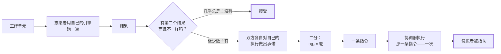

<div align="center">

# Cairn

[English](README.md) · **简体中文**

**用碎片时间拼出来的超级计算机。**

打开一个浏览器标签页，捐出你本来闲着的 CPU，去算一点真正要紧的东西。
不用安装，不用注册，没有代币。

[](LICENSE)
[](#路线图)

</div>

---

> Cairn 是路边的一堆石头。每个走过难走路段的人，往上添一块。
> 单独一块石头不是路标，那一堆才是。

---

> **关于本文**：项目的代码、注释和全部文档都是英文的，这是有意的——它要能被不认识作者的人接手。
> 这份中文 README 是英文版的完整对照，不是摘要：同样的段落、同样的数字、同样被推翻的结论。

## 这是什么

世界上有数十亿颗闲置的 CPU。志愿计算以前收割过它们，也确实产出了真科学——2020 年疫情期间，
Folding@home 的算力一度超过了全球顶尖超算的总和。

但让那件事成为可能的软件是 2002 年设计的，它带着两笔从没被解决的成本：

**你得先装个东西。** 光是这一步，就劝退了几乎所有人。

**网络里有一半的算力，在重做已经做对了的事。** 志愿者的机器不可信——有人为了刷积分撒谎，
更多人是因为内存要坏了或 CPU 超频过头，交回来的结果本身就是错的。经典的防御手段是把每个任务
发给两三台机器，然后对比。这招管用，代价是把人们捐出来的算力扔掉三分之一到一半。

Cairn 同时攻这两个问题。

第一个是工程问题：worker 就是一个 Web Worker，包在浏览器本来就有的 WebAssembly 引擎外面。
打开一个网页就是全部的上手流程——不用安装、零依赖、零构建步骤。[`browser/`](browser)
今天就是这么做的。

第二个才是这个项目存在的理由。验证机制能用、仲裁便宜，而且——在下文描述的一次设计修正之后——
在大多数负载上，诚实的志愿者几乎不用为它付出任何代价。浮点是例外，那是这个项目公开的难题。

## 核心想法

**验证和重算，不是同一件事。**

志愿者把任务跑一遍，交回答案。没别的了——没有证明，没有轨迹。大多数任务在这**一次**执行之后
就被接受。信心来自"诱饵任务"——答案我们早就知道的任务，悄悄混进任务流——加上一份根据工作者
如何应对这些诱饵而累积的信誉分。

当两个工作者**确实**交回了不同的答案，没有任何人会把任务重跑一遍去看谁对。取而代之的是，
双方各自被要求"把过程亮出来"：他们在插桩状态下重新执行，交回一份对自己执行过程的密码学承诺。
然后他们玩一场二分游戏——在这些承诺上做二分查找，一路收敛到**两次执行第一次分岔的那一条
机器指令**——协调器执行那一条指令，就知道谁在撒谎。



**看这张图要看流量有多粗，而不是有多少个方框。** 几乎每一个单元都走最上面那一行然后就结束了。
底下那套机器存在的意义，是让最上面那一行只需要执行**一次**而不是两三次——而且它只在真的有人
不同意的时候才启动。

**检查一条指令，而不是十亿条。** `O(log n)` 条消息，工作量不随争议任务跑了多久而增长——
仲裁一个万亿指令的单元，和仲裁一个一千指令的单元一样贵。

这套机制借自 optimistic rollup，把它从金融指向了科学。完整设计，包括为什么"逐位精确的确定性"
是硬性要求以及它的代价，在 **[ARCHITECTURE.md](ARCHITECTURE.md)**。

## 测出来的东西

`cargo bench` 会重新生成 [docs/benchmarks.md](docs/benchmarks.md)。简版：

| 主张 | 状态 |
|---|---|
| 仲裁成本与执行长度无关 | **已确认。** 2.1 万步 → 15 轮；210 万步 → 21 轮。长度 512 以内的**每一个**分岔点都被穷举检查过，而文档里写的 `⌈log₂ n⌉` 其实是一条**带**——`⌈log₂ n⌉ - 1` 到 `⌈log₂ n⌉`，上界可达 |
| 见证很小 | **已确认，附带一条现在由测试钉住的但书。** 普通指令一个 64 KiB 页；`memory.fill` 的长度说多远就伸多远，10 万字节碰两页 |
| 计量不会改变程序算出什么 | **已确认。** 每一个差分用例、两个引擎，输出与陷阱行为完全一致 |
| 插桩开销约 5% | **已推翻。** 差得远——见 ADR-0004 |
| 志愿者能对自己的执行做出承诺 | **已推翻。** 一个现成的 WASM 引擎藏起了承诺所需七个字段中的四个——见 ADR-0005 |
| NaN 的载荷位改变不了答案 | **在三个引擎上（含一个 JIT）、300 个随机生成的浮点表达式上确认。** 而且验过牙口：删掉一个逃逸点，它就会红 |
| 解释器在任意代码上与真实引擎一致 | **还不能这么说。** 整模块生成第一次跑就找出一个 bug——函数作用域下的 `br 0` 是返回，而 Cairn 没有函数标签。已修；146 个生成模块现在一致。目前只是"没有反证" |
| 诚实路径不让志愿者付出代价 | **在编译器上已确认**——wasmtime 上四种形态全部 0%，含浮点 |
| Cairn 在成本上胜过冗余复算 | **目前是。** ≈1.09×–1.18×，对冗余复算的 ≈2.0×，四种负载形态全部如此 |
| 仲裁争议对**协调器**很便宜 | **已确认。** `O(log n)` 条消息加一条指令，不管执行多长 |
| 仲裁争议对**争议双方**也便宜 | **不。** 他们必须在 Cairn 的解释器上重新执行才能产出轨迹，而它比他们干活时用的引擎慢 37×–142× |
| 一方的争议成本由执行长度决定 | **已推翻。** 由**两方在哪里分岔**决定。带检查点的重放让一次晚分岔的 190 万步争议便宜 **14.4×**，让早分岔的那种一点也没便宜 |

最后那一行，是三次反转之后才走到的，而且一次都没藏：

1. 测量**推翻**了最初的成本主张——假设的 ≈5%，实际差得远
   ([ADR-0004](docs/adr/0004-measured-cost-supersedes-the-efficiency-claim.md))。
2. 它底下的执行模型被发现**根本建不出来**——现成的 WASM 引擎不会把操作数栈给你看——
   所以轨迹被挪到了争议发生的时候
   ([ADR-0005](docs/adr/0005-the-fast-path-cannot-snapshot.md))。这一下把计量和快照
   从诚实路径上拿掉了，只剩下"让浮点逐位精确"的代价。
3. 最后这笔代价也被发现是可以避开的：引擎自选的 NaN 只在它的位可能变成"不是 NaN 的东西"时
   才要紧，而那只有**四个操作**
   ([ADR-0006](docs/adr/0006-canonicalize-nans-at-escapes-on-the-honest-path.md))。
   浮点内核的诚实路径指令数从 2.30× 裸执行降到了 **1.00×**。

**所以 ADR-0001 的结论是对的，而它的推理仍然是错的。** 那个数字回来了，是因为诚实路径现在
几乎什么都不做，不是因为最初 5% 的估计准。两件事都写在 ADR 里。

紧接着来了第四次反转，方向相反。上面每一个数字都出自 Cairn 的解释器。把同样的负载放到
**wasmtime**——一个真正的优化编译器——上跑，确认了诚实路径确实免费，同时暴露出燃料计量在那里
要花 **五到六倍**，而在解释器里只要 18%–41%
([ADR-0007](docs/adr/0007-metering-is-a-jit-problem-not-an-interpreter-problem.md))。
**你在哪个引擎上测量，本身就是测量的一部分。**

然后是第五次，来自一个问题：那个模块到底是谁在跑？答案是没有人。一份轨迹承诺覆盖操作数栈和
每一个栈帧的局部变量，所以被质询的一方在自己的引擎上产不出承诺，跟志愿者一样产不出。
**他们要在 Cairn 的解释器上重新执行，而它比他们干活时用的 JIT 慢 37×–142×**
([ADR-0008](docs/adr/0008-a-dispute-costs-an-interpreted-re-execution.md))。这才是一次争议的
真实价格，它落在双方而不是协调器身上，而且它给"争议可以多频繁"设了一条硬预算——
**低于大约每 4000 个单元一次。**

第六次，来自终于动手去做第三第四次一直在绕的那个修复。用计数器全局变量代替宿主调用来计量，
在编译器上**快 3–6 倍，在解释器里慢 9%–26%**——而解释器是唯一会跑带计量模块的引擎，所以这个
改动让争议**更贵**而不是更便宜，争议路径保留了宿主调用
([ADR-0009](docs/adr/0009-metering-through-a-global-the-engines-disagree.md))。
它换来的是一件没人要求、但所有人都会想要的东西：在编译器上，计量开销从 **+540% 降到 +8%**，
这意味着**一个 Cairn 管不着的引擎，现在能报告自己干了多少活**——跑完模块，读那个导出的计数器。
在志愿者能接受的任何价格内，这件事以前都做不到。

**这套基准测试测量的是它自己的误差，而不是断言一个误差**——它给若干"编译出来字节完全相同"的
配置计时。当误差超过效应本身，那个数字会被印成 *not resolved* 而不是当成结论——某一次早期运行
里它到过 148%，而更早版本的基准会把那些数字当作发现报出来。

## 技术栈

| 层 | 选择 | 为什么 |
|---|---|---|
| 协调器 | **Rust**、`tiny_http` | **裁判要执行指令**——裁决要把机器从状态见证里重建出来再走一步，所以 Java 协调器要么用 JNI、要么起子进程、要么把共识关键代码实现第二遍。等到有了数据库，它想要的仍然是 Java 21 + Spring；[ADR-0010](docs/adr/0010-the-referee-executes-so-the-coordinator-is-rust.md) 是**暂缓**而不是推翻 |
| 执行内核 | **Rust** | 确定性解释和指令级重放；JVM 做不了这个 |
| 浏览器 worker | **JavaScript**，零构建 | 在 Web Worker 里零安装贡献，包在页面已有的引擎外面。Rust→WASM 一直是计划，直到 ADR-0005 让它变得没必要 |
| 原生 worker | **Rust** + SQLite | 单个二进制、可续跑，给捐出来的机器用 |
| 记录系统 | **PostgreSQL** | 单元、结果、轨迹承诺、争议 |
| 热路径 | **Redis** | 队列、租约、心跳、面板扇出 |
| 前端 | **React 19** + TS + Tailwind + three.js | 地球仪显示的是实时节点拓扑，不是动画 |

这里没有 Go 服务，而且是刻意的——Java 21 的虚拟线程已经覆盖了高并发那一档，一门语言要在这里
占一个位置，得能做别的语言做不到的事。见 [ADR-0002](docs/adr/0002-language-boundaries.md)。

## 快速开始

**赶时间，或者想要带讲解的版本？**[docs/WALKTHROUGH.md](docs/WALKTHROUGH.md) 是二十分钟六条命令，
每一条回答一个问题，最后以"一场一百万条指令的分歧被执行一条指令解决"收尾。（英文）

否则：只装 Rust，别的都不用。做一个工作单元：

```bash
cargo run -p cairn-worker -- run workloads/examples/sum-of-squares.wat workloads/examples/input-a.bin
```

现在让两个志愿者对同一个单元产生分歧，然后查出谁在撒谎：

```bash
cargo run -p cairn-worker -- dispute workloads/examples/sum-of-squares.wat workloads/examples/input-a.bin workloads/examples/input-b.bin
```

```
disputed length   1050030 instructions
bisection rounds  20
divergence        step 1050016
time to bisect    39.8ms

Adjudicating that one instruction took 52.3µs.
Verdict: the second party was wrong.
```

逐行是：争议长度 1050030 条指令；二分 20 轮；分岔发生在第 1050016 步；二分耗时 39.8 毫秒；
裁决那一条指令花了 52.3 微秒；判决——第二方是错的。

**这一条命令就是全部想法。** 一场一百万条指令的分歧，靠执行**一条**指令解决——
而裁判那 52 微秒，正是执行变长时不会跟着变长的东西。`cairn-worker trace` 展示另一半：
同一个单元，在解释器上，产出让这场二分成为可能的那份承诺。

想**看着它发生**而不是读关于它的描述——每一轮二分、区间怎么收窄、协调器最后执行的是哪一条指令：

```bash
cargo run --example dispute
```

### 整个系统，一条命令

```bash
cargo run -p cairn-coordinator -- workloads/examples/sum-of-squares.wat \
  workloads/examples/input-a.bin workloads/examples/input-b.bin
```

打开它打印出来的地址，点 **Start contributing**。这个标签页会领一个单元、用浏览器自己的引擎跑掉、
把答案**和它花了多少条指令**报回去，然后再要一个。再开一个标签页，两个志愿者就会互相确认——
一个单元要等**不同的**志愿者达成共识，才会从 `open` 变成 `accepted`。

### 隔着网络，看一个说谎者被二分出来

先起一个把每个单元都复算一遍的协调器，再起两个志愿者，其中一个说谎：

```bash
cargo run --release -p cairn-coordinator -- workloads/examples/sum-of-squares.wat \
  workloads/examples/input-a.bin --replicate 100
```

```bash
cargo run --release -p cairn-worker -- volunteer http://127.0.0.1:8080 --name honest
```

```bash
cargo run --release -p cairn-worker -- volunteer http://127.0.0.1:8080 --name liar --lie-from 500000
```

然后读 `http://127.0.0.1:8080/api/disputes`：

```json
{"state":"settled","by":"bisection","rounds":20,"messages":47,
 "verdict":"the second party lied about the instruction at step 499999, found in 20 rounds
            of bisection and proved by executing that one instruction",
 "output":"bd3e5cfce4250000"}
```

**1,050,030 条指令。20 轮。47 条消息。协调器执行了 1 条指令。** 两个志愿者各自在自己的机器上
重放；诚实的那一方把有争议的那个状态连同证明一起交了上来，裁判走了一步，就看出谁在撒谎。
**没有任何人重跑那个单元。**

说谎者必须**撒两次谎**——一次在答案里，之后在它声称的每一个状态根里再撒一次。`--lie-from`
两件都干，因为只撒一次算不上作弊：重放是确定性的，所以一个如实回答挑战的人会还原出真相，
和所有人一致。

**而不能争论的志愿者，绝不会被挑战。** 回答挑战意味着要给出状态根，浏览器引擎做不到。那类
分歧由裁判自己重新执行来定——这是一条**路径，不是缺口**，因为去挑战一个答不了的志愿者，
等于因为它沉默而给它定罪。见
[ADR-0011](docs/adr/0011-a-volunteer-that-cannot-argue-is-not-challenged.md)。

### 或者只跑浏览器 worker，不带协调器

```bash
node browser/server.js
```

页面用你浏览器本来就有的引擎跑同一个单元，并报告 **850,022 条指令**——和 Cairn 的解释器对
**同一串字节**报出的数字分毫不差，而它是靠读模块导出的一个计数器得到的，不是被谁告知的。
**这份一致才是重点，而且它是精确的**；页面上的耗时不是受控测量，[它自己的 README](browser/README.md)
把这一点写明了。[`browser/`](browser) 里没有 WebAssembly 引擎，而且本来就不该有——
同一份 README 解释了为什么那是设计而不是偷懒。

要验证这一页上的主张而不是相信它们：

```bash
cargo test --workspace
```

280 个测试，另外 `node --test browser/policy.test.js` 还有 12 个。其中包括：一个逐指令对照
**两个**独立 WASM 引擎（含一个 JIT）检查过的解释器、每次运行 300 个随机生成的浮点表达式和
200 个整模块、一场收敛到被篡改指令上的二分游戏，以及一次不重放任务就点出说谎者的裁决。
然后 `cargo bench` 会重新生成上面那些数字，包括结果很难看的那些。

## 路线图

Cairn 是在一个刻意压短、写死的时间窗里建的，取向是**窄而完成**，而不是**宽而烂尾**。

**存在的是验证内核、两个 worker，以及一个把它们串成系统的协调器。** 不在这里的：数据库、信誉、
诱饵任务、惩罚机制、面板，以及真实科学负载。这一点被直说出来，而不是靠没打勾的复选框暗示。

| 里程碑 | 状态 |
|---|---|
| 仓库、CI、架构决策记录 | **完成**——CI 跑的是真正的确定性门禁，不是占位符 |
| **确定性执行内核 + 轨迹承诺** | **完成**——约 14,900 行 Rust 源码，280 个测试 |
| **交互式二分仲裁** | **完成**——收敛到一条指令，从状态见证裁决，从不重放 |
| 基准测试 + 维护者交接 | **完成**——而且基准推翻了三条头条主张；见上文 |
| **原生 worker** | **完成**——`cairn-worker`，在 JIT 上跑一个单元，并端到端了结一场争议 |
| **浏览器志愿者** | **完成**——包在页面自身引擎外面的 Web Worker；零安装、零依赖、零构建 |
| **协调器：注册、队列、租约、法定人数、裁判** | **完成**——Rust，内存态，无数据库；系统端到端跑得通 |
| **交互式争议协议，跑在网络上** | **完成**——1,050,030 条指令的分歧，20 轮、协调器执行 **1** 条指令 |
| 协调器：持久化、心跳 | 未开始 |
| 验证策略：诱饵、信誉 | 未开始——复算率有了，其余没有 |
| 面板 + 实时地球仪 | 未开始 |
| 一个真实的科学负载（分子对接） | 未开始 |

这个顺序是刻意的：先建最难、最新、**最容易被证伪**的那一部分，这样万一窗口提前关上，
留下来的会是别人没有的那个东西，而不是一个谁都写得出来的任务队列。

## 参与

这个项目是明确按"要被没写过它的人接手"来建的。

- **[docs/MAINTAINER.md](docs/MAINTAINER.md)**——项目的诚实现状：什么能用、什么不能用、
  八条不能破的不变量，以及你的第一个小时、第一天、第一周该做什么。
- **[docs/GOOD_FIRST_ISSUES.md](docs/GOOD_FIRST_ISSUES.md)**——写清楚了的真活儿，标了工作量，
  每一条都说明从哪里下手、怎么知道自己做完了。**现在全部关闭**——这一页变成了"每一条实际教会了
  什么"的记录，而那比工单本身值钱：四条的结局和当初写的不一样，其中一条完全相反，还有一条在
  被写下来之前就已经做完了。
- **[docs/WALKTHROUGH.md](docs/WALKTHROUGH.md)**——二十分钟六条命令，配真实输出，最后给一条
  阅读顺序。要把这个项目交给别人，就交这一份。
- **[docs/WORKLOADS.md](docs/WORKLOADS.md)**——怎么写一个 Cairn 能跑的程序：完整的接口、
  一个能用的例子（WAT 和 Rust 各一个），以及每一条拒绝背后的确定性理由。
- **[ARCHITECTURE.md](ARCHITECTURE.md)**——各部分怎么拼起来，以及为什么确定性是硬性要求
  而不是一个不错的性质。
- **[CONTRIBUTING.md](CONTRIBUTING.md)**——环境搭建、测试，以及那一条不可商量的规则。

## 许可

[Apache-2.0](LICENSE)。
